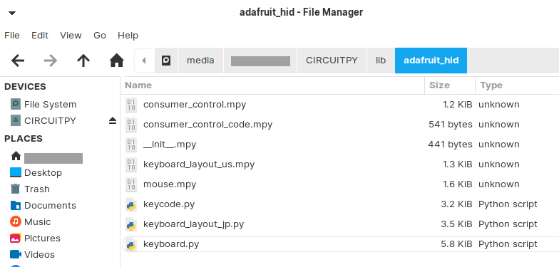

(For English speaker)
This project is for Japanese keyboard type 106 or 109.
Sorry to describe only in Japanese.

# 概要
Raspberry pi pico の Circuitpythonで提供されているUSBキーボードモジュール、adafruit_hidの日本語キーボード配列モジュールです。
以下のようなキーが日本語配列で送信できます。

[@_\|￥"'^= 半角/全角 無変換 変換]

# 利用方法
CircuitPythonをRaspberry pi picoに導入後、以下のフォルダに配置してください


# サンプルプログラム
入力した文字をUSBキーボードとして送信するプログラム
```
from adafruit_hid.keycode import Keycode
from adafruit_hid.keyboard import Keyboard
from adafruit_hid.keyboard_layout_jp import KeyboardLayoutJP

keyboard = Keyboard(usb_hid.devices)
layout = KeyboardLayoutJP(keyboard)

# writeした文字列がPCに実際にタイプされたものとして送信されます
# キーボードの半角文字しか送れません。
# 全角を送りたい場合は全角ボタンを送信後にwriteする必要があります
layout.write("abc-ABC\+= ..,,<>@")
```
 
特殊キーの送信の仕方
（お待ちください）

# キーコードで送信する場合について
Functionキーなど、特殊キーを送信する場合はキーコードを指定します。
keycode.pyに羅列されています

(サンプルコードはお待ちください)


